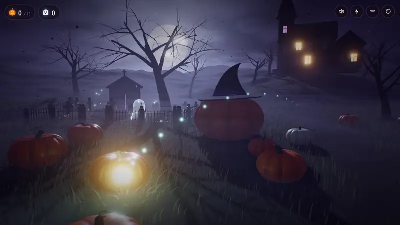
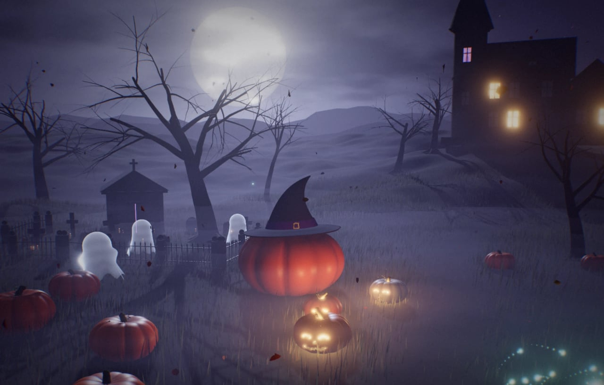
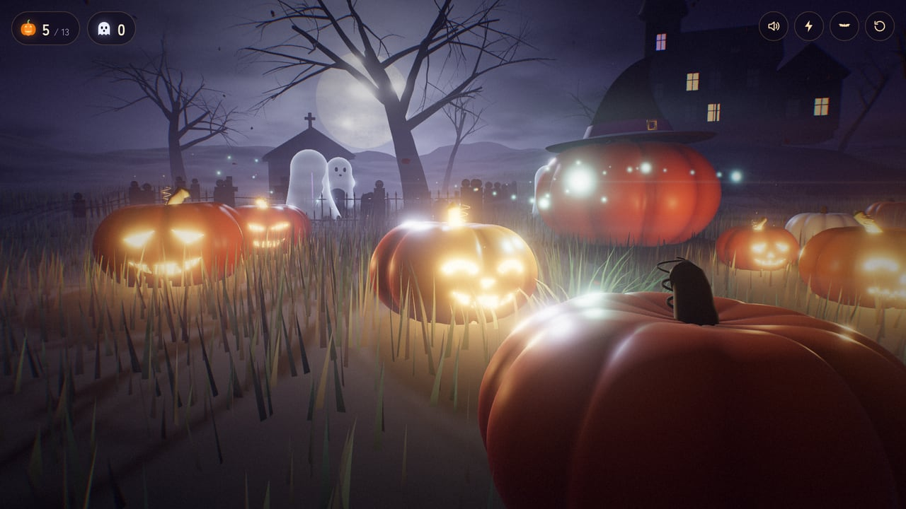
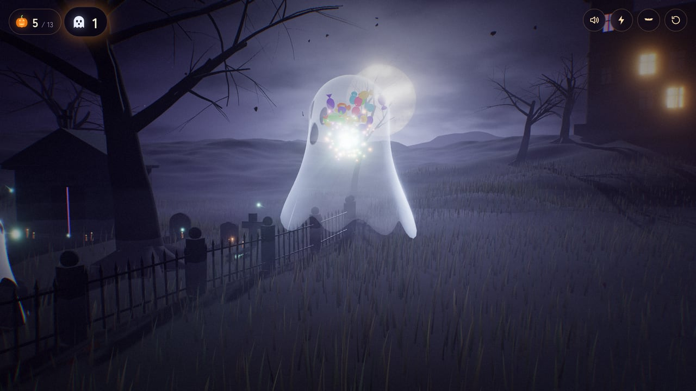
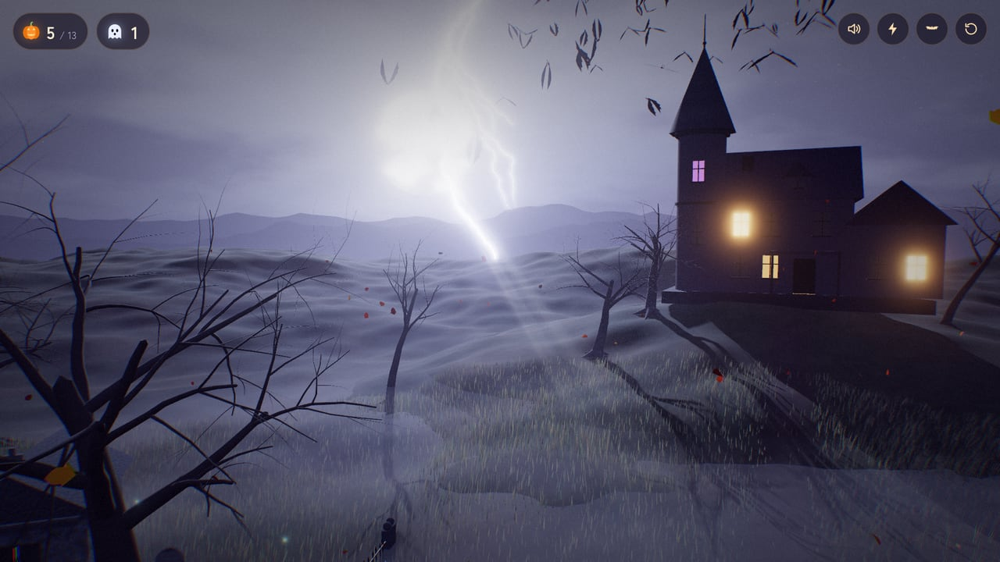
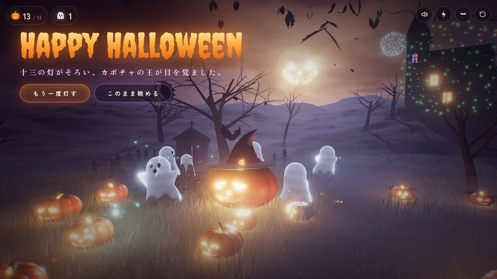
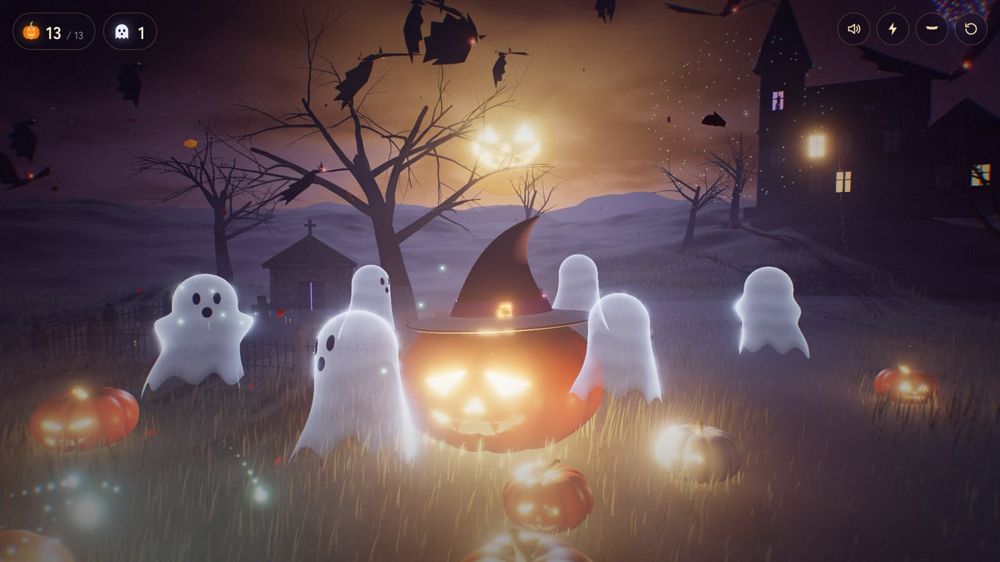

# Lantern Night — 灯りの夜

鬼火になって、墓地のそばの十三のカボチャに灯をともす。Three.js で描くハロウィンの夜のインタラクティブアート。

[](https://tanuu5.github.io/lantern-night/)
[](https://www.anthropic.com/claude)
[](./LICENSE)

<p align="center">
  
</p>

<p align="center"><b><a href="https://tanuu5.github.io/lantern-night/">▶ ブラウザで遊ぶ：https://tanuu5.github.io/lantern-night/</a></b></p>

**Claude Code × Claude Opus 5.5（XHIGH）** で作りました。

月の昇った墓地のそばに、十三のカボチャが眠っています。あなたは迷い込んだ鬼火。カーソルで鬼火を動かし、カボチャをクリックすると、鬼火が飛び込んで顔を彫り、灯がともります。十三すべてを灯すと、カボチャの王が目を覚まします。

画像・音声ファイルは使っていません。地形、木、墓石、屋敷、カボチャの顔、空、音楽と効果音まで、すべてコードで生成しています。

## スクリーンショット

<table>
  <tr>
    <td><br><sub>月夜の墓地。灯ったカボチャのまわりに、おばけが起きてくる</sub></td>
    <td><br><sub>彫られて灯ったカボチャ。顔は 13 個すべて違う</sub></td>
  </tr>
  <tr>
    <td><br><sub>驚かせたおばけは、お菓子になってはじける</sub></td>
    <td><br><sub>屋敷から飛び立つコウモリと、遠くに落ちる稲妻</sub></td>
  </tr>
  <tr>
    <td><br><sub>十三の灯がそろうとフィナーレ</sub></td>
    <td><br><sub>月に顔が浮かび、おばけが王のまわりで踊る</sub></td>
  </tr>
</table>

画像と動画は、すべて実際の画面です。

## 遊び方

| 操作 | 内容 |
| --- | --- |
| マウス移動 | 鬼火が地面の上をついてくる（草がよける） |
| ドラッグ / ホイール | 見回す / 寄る・引く |
| カボチャをクリック | 鬼火が飛んでいき、顔を彫って灯す |
| おばけをクリック | 驚かせると、お菓子になってはじける |
| 屋敷をクリック | コウモリの群れが飛び立つ |
| 空をクリック | 遠くに稲妻が落ちる |
| キー `L` / `B` / `M` / `R` / `H` | 稲妻 / コウモリ / 消音 / 最初から / UI の表示切り替え |

スマートフォンの縦画面にも合わせてあります（タップで灯す・スワイプで見回す）。音が出るので、音量にご注意ください。

## しくみ

- **霧**: three.js 標準のフォグを置き換え、高さで薄くなる指数フォグに、流れるノイズと月方向への散乱を加えています。地表には別に 4 層の霧があり、灯ったカボチャの光で下から温かく照らされます。
- **カボチャ**: 球を変形してリブを作り、顔はキャンバスに描いた型をシェーダーでくり抜いています。穴の向こうに見える内側の面を発光させ、中に点光源を置いています。顔は 13 個すべて違います。
- **空**: 月（クレーター、海、周辺減光）、雲、星、地平線の霞をひとつのシェーダーで描いています。フィナーレでは月にジャック・オ・ランタンの顔が浮かびます。
- **生きもの**: シーツおばけ（裾の揺れ、まばたき、照れて逃げる）、群れで飛ぶコウモリ、尾を引く人魂、舞い落ちる落ち葉、跳ねるお菓子。
- **ポストエフェクト**: 月の光芒（放射ブラー）、ブルーム（ぼかしを正しいガウス分布に組み直したもの）、ACES トーンマッピング、色収差、ビネット、フィルムグレイン。
- **音**: Web Audio API だけで、風、低いドローン、虫の声、フクロウ、オリジナルのオルゴールのワルツ（イ短調）、点火・おばけ・雷・花火などの効果音を合成しています。
- **負荷調整**: フレームレートが続けて落ちたときだけ描画解像度を下げ、余裕が戻れば上げ直します。

## 制作について

企画・ディレクション：**たぬ**　／　開発：**Claude Code（Claude Opus 5.5・推論レベル XHIGH）**

設計から実装、調整まで Claude Code が進めました。見た目と操作は、ヘッドレス Chrome（実 GPU）で実際の画面を撮って確かめながら詰めています。

## 更新履歴

- **2026-10-03**：公開

## 開発

ビルドは不要です。ES Modules を使っているため、ファイルを直接開くのではなく、ローカルサーバー経由で開いてください。

```bash
npx serve .
```

または

```bash
python3 -m http.server 8173
```

three.js と Web フォントは CDN から読み込むので、インターネット接続が必要です。

## クレジット・ライセンス

- コード：MIT License（[LICENSE](LICENSE)）© 2026 たぬ
- 3D 描画：[three.js](https://threejs.org/) r170（MIT License）
- フォント：Creepster / Zen Antique / Zen Kaku Gothic New（Google Fonts、SIL Open Font License）
- MIT License の対象はこのリポジトリのコードと文章です。「Claude」の名前や商標の使用を許諾するものではありません。
